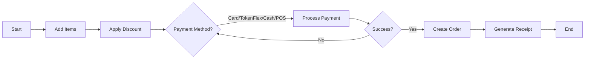

# Process Flows

## Purchase Flow


## Refund Flow
```mermaid
flowchart LR
A[Refund Request] --> B[Find Order]
B --> C{Eligible?}
C -->|Yes| D[Create Refund Record]
D --> E[Update Revenue (-)]
E --> F[End]
C -->|No| X[Reject]
```
